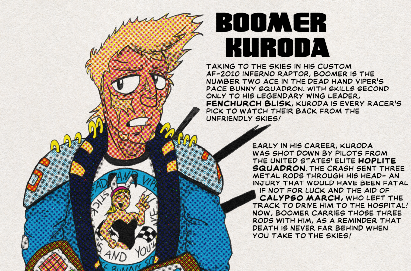

Hello again from the high seas in the harbour of HALIFAX_1! The Binary Order temporarily derezzed all the land from here to Neo-Truro so we're taking a short nautical detour while we sort that out. 

Speaking of things sucking, you wanna hear about the most hated action figure in the Dead Hand Vipers lineup? That's right! It's time to talk about Boomer Kuroda!

I don't have a comic ready to go but I'll embed the partial datasheet at the end of the blog post. These datasheets were quick side projects that Benson Corbett came up with- something to bundle in with the action figure. The full-size datasheets were never released as such, but Titania Schnell wasn't one to give a product an even break so Tennyson's art got squashed down to tarot card size and Corbett's writeups were cropped down to the "Valiant Facts!" section. Thankfully, Corbett preserved all the datasheets in his personal archive, so that we can see them all now! 

Anyway, Kuroda. People actually liked the character pretty well. The idea was that the Dead Hand Vipers, being illegal street racers, needed some cover in case cops or the army or whatever decided to try to shut them down. Enter the Pace Bunny Squadron- a mismatched gaggle of wacky ace pilots who took to the air over every DHV race to guard the drivers. Kuroda and his wing commander Fenchurch Blisk were the only ones to make the DHV set proper, but a few others crept in through other lines over the years. Kuroda's purpose in most episodes was to play the straight man to the goofy racers and his nutty wingmen, and while kids tended to see him as a bit of a killjoy, his put-upon, hangdog attitude played well with older audiences.

Plus, the dogfight scenes in _The Valiant Stars_ always had a reputation for looking _great_. It's plain to see why- in most any episode where a dogfight took place, they really leveraged the time-saving measure of having characters' faces covered by helmets. But the head of animation at the time, Geno Crisp, wasn't a corner-cutter, and if the money and time didn't get used one place, he made sure it got used somewhere else. That usually meant leaning on the studio's star animator, Zoe Leefler. Among other things, Leefler was a certified sicko when it came to anything mechanical. She had made a go as an artist on a mecha series, _Titanomachy_, but couldn't muster enthusiasm for drawing anything other than the mechs and vehicles. Fortunately, Crisp knew how to put her particular derangements to good use- if there's a cockpit, a giant robot, a spaceship, or even something as small as a water pump, you can bet Leefler either animated it herself or at least did the key frames. 

Pilots, naturally, were the major beneficiaries of Leefler's talents, and none so much as Kuroda, whose custom Inferno Raptor fighter could enter 'Inferno Mode'- a special operating mode that overcharged its laser beams, boosted its engines, and activated a rare Graviton Diffusion Engine that let Kuroda make hairpin turns and banks that would otherwise force a blackout. The lead-in to Inferno Mode was always the same, but it never got old- Kuroda's gloved hand thumbing switches and cranking dials before finally grabbing a big red lever and pushing it all the way to its highest setting. The gusto in the little hand movements and the satisfying way the machinery clicked into place was a perfect way to psych up the audience for Kuroda's big dramatic moments. 

So why did people hate the action figure so much? Well, remember when I mentioned in Calypso March's description that Kuroda's figure came packaged with rebar clubs, a custom helmet, and a remote piloting rig? The helmet and the rig were both repurposed from the molds used for Fenchurch Blisk's set (which came out first). They at least gave the helmet different decals, but the rebar clubs were nothing more than three lightly ridged rods of unpainted black plastic. It's not like these _weren't_ a part of Kuroda's character (see the datasheet), but compared to the gubbins on offer for the other characters, this was a major cheap-out. The clubs didn't even slot into the figure's pack anywhere, so you just had to have them loose (or tape them to the figure, like many did). Imagine how many of these things went missing down heating vents or under bookcases! 

So, why the corner-cutting? Well, now you know why Titania Schnell has a bit of a bad rap among Laughing Lizard fans. The Dead Hand Vipers were the third set released (after the Kitty Kissbang and Ash Blake space pirate sets), and since those had been well-received, a lot of people think Schnell was just resting on her laurels- coasting through summer and saving money in anticipation of major pre-Christmas releases. This would happen a few more times through 1991, with obviously cheap figures being released to middling reception, but by 1992 corporate and creative seemed to have reached a balance, and the post-1992 sets are, for the most part, golden. 

But that's a story for another day! Until that day, I've got to keep bailing water out of the Mobile HQ. Oh, yeah, did I not mention that? Yeah we took a hit from a Binary Order torpedo in the middle of this blog post and now we're goin' down! I'm not worried- the Mobile HQ is fully submersible and rated for 100,000 fathoms, but I can't be headed to the ocean floor! I got places to be today! Here's the datasheet I promised! The whole thing will go up with the comic!

Well, that's all from me today, Snakepunks! Until I see you again-

